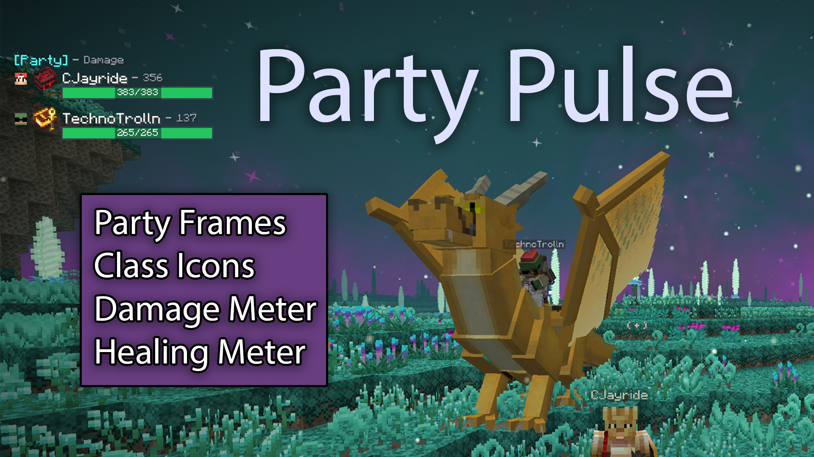
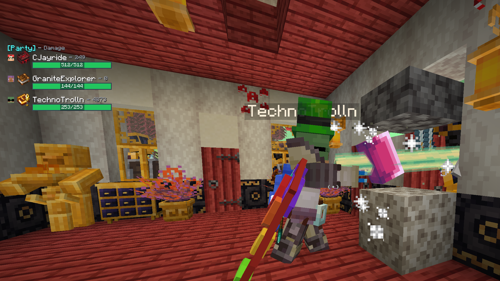
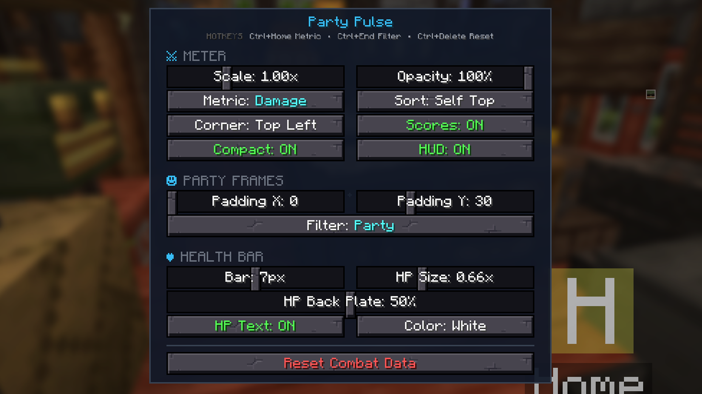

# Party Pulse

Party frames and combat metrics for Fabric 1.20.1 RPG modpacks.

Track live party health, Damage Done, DPS, Healing Done, and HPS — with
configurable layout, filtering, and hotkeys.

**Built and tested for [Prominence II: Hasturian Era](https://www.curseforge.com/minecraft/modpacks/prominence-2-hasturian-era).**
It is intended to be played with that pack (Spell Engine healing, party play,
trinket class icons), and should also work in other Fabric 1.20.1 RPG setups
that use the same optional mods.

☕ If Party Pulse improves your gaming experience, you can [buy me a coffee](https://buymeacoffee.com/cjayride). ☕

## Screenshots







## Requirements

- Minecraft **1.20.1**
- Fabric Loader
- [Fabric API](https://modrinth.com/mod/fabric-api)

### Optional (recommended)

| Mod | What it unlocks |
| --- | --- |
| [Spell Engine](https://modrinth.com/mod/spell-engine) | Caster-attributed Healing Done / HPS |
| [Open Parties and Claims](https://modrinth.com/mod/open-parties-and-claims) | Party roster / party frames |
| [Trinkets](https://modrinth.com/mod/trinkets) | Spellbook icon next to player names |

Install **Party Pulse on the server and on each client** that should see the HUD.
Combat is measured server-side, so other players do not need the mod for their
damage to appear on your meter.

## Install

1. Install Fabric for 1.20.1 and Fabric API.
2. Drop `party-pulse-<version>.jar` into the `mods` folder (client + server).
3. Launch the game. Open settings with `/pulse menu`.

## Features

- Party frames with live health / max health
- Damage Done and DPS tracking (post-mitigation, including friendly fire)
- Healing Done and HPS: Spell Engine heals credit the caster; self-heals
  (e.g. Death Strike), health potions / flasks, and other `heal()` sources
  credit the healed player (effective heal only — no overheal). Compatible
  with Prominence II 4.0 (does not steal Spell Engine's heal `@Redirect`)
- Cycle metrics: Damage → DPS → Healing → HPS
- Party vs Nearby filter (Nearby uses a 128-block range)
- Combat metrics only show for players within 128 blocks in your dimension;
  health frames still update everywhere for party members (server-synced,
  including other dimensions)
- Configurable corner, scale, opacity, bar height, HP text, sorting

## Commands & hotkeys

All chat commands use the `/pulse` prefix. Keybinds require **Ctrl** plus the
bound key (defaults below). Rebind under **Controls → Party Pulse**.

### Keybinds

| Hotkey | Action |
| --- | --- |
| `Ctrl` + `Home` | Cycle metric: Damage → DPS → Healing → HPS |
| `Ctrl` + `End` | Toggle filter: Party ↔ Nearby |
| `Ctrl` + `Delete` | Reset combat session totals to 0 |

### Chat commands

| Command | Action |
| --- | --- |
| `/pulse menu` | Open the settings screen |
| `/pulse toggle` | Show or hide the entire HUD |
| `/pulse mode` | Cycle Damage → DPS → Healing → HPS |
| `/pulse filter` | Toggle Party ↔ Nearby |
| `/pulse corner` | Move the HUD clockwise around screen corners |
| `/pulse numbersonly` | Hide combat score numbers (frames + health only) |
| `/pulse sorting` | Cycle sort: Ranked → A-Z → Self Top |
| `/pulse values` | Toggle compact numbers (`12.3K` vs `12345`) |
| `/pulse hptext` | Toggle health number text on the bar |
| `/pulse reset` | Reset combat session totals to 0 |

### Settings menu only

These are available in `/pulse menu` (no chat command):

- Meter **Scale** and **Opacity**
- Party frame **Padding X / Y**
- Health bar **height**, **HP text size**, **back plate opacity**, and **HP color**

## Building

```bash
./gradlew build
```

The uploadable jar is:

```text
build/libs/party-pulse-<version>.jar
```

Do **not** upload `-sources` or `-dev` jars to CurseForge / Modrinth.

Local Spell Engine reference jars under `reference-mods/` are optional developer
notes only and are gitignored — builds pull compile-only APIs from Modrinth Maven.

## License

Party Pulse is available under the [CC0 1.0](LICENSE) license.

☕ If Party Pulse improves your gaming experience, you can [buy me a coffee](https://buymeacoffee.com/cjayride). ☕
