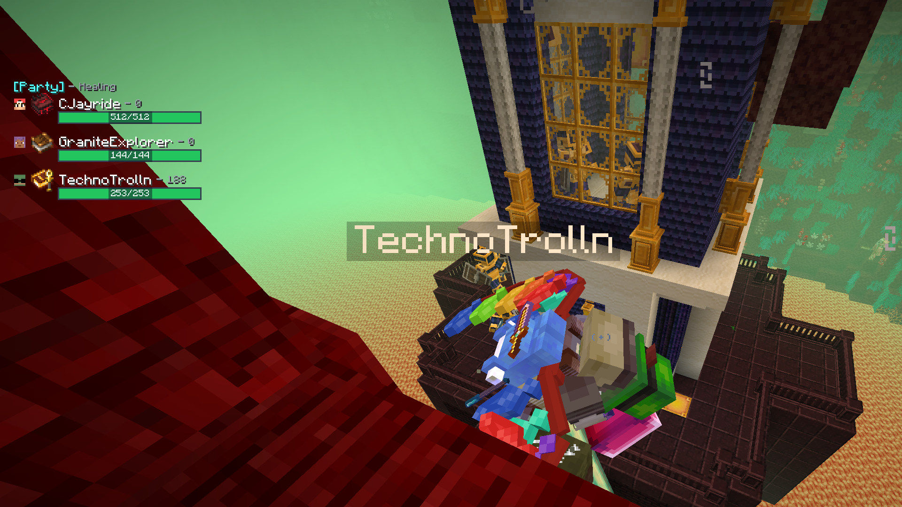

# Party Pulse

Party frames and combat metrics for Fabric 1.20.1 RPG modpacks.

Track live party health, Damage Done, DPS, Healing Done, and HPS — with
configurable layout, filtering, and hotkeys.

## Screenshots





## Requirements

- Minecraft **1.20.1**
- Fabric Loader
- [Fabric API](https://modrinth.com/mod/fabric-api)

### Optional (recommended)

| Mod | What it unlocks |
| --- | --- |
| [Spell Engine](https://modrinth.com/mod/spell-engine) | Caster-attributed Healing Done / HPS |
| [Open Parties and Claims](https://modrinth.com/mod/open-parties-and-claims) | Party roster / party frames |
| [Trinkets](https://modrinth.com/mod/trinkets) | Spellbook icon next to player names |

Install **Party Pulse on the server and on each client** that should see the HUD.
Combat is measured server-side, so other players do not need the mod for their
damage to appear on your meter.

## Install

1. Install Fabric for 1.20.1 and Fabric API.
2. Drop `party-pulse-<version>.jar` into the `mods` folder (client + server).
3. Launch the game. Open settings with `/pulse menu`.

## Features

- Party frames with live health / max health
- Damage Done and DPS tracking (post-mitigation, including friendly fire)
- Healing Done and HPS when Spell Engine is present
- Cycle metrics: Damage → DPS → Healing → HPS
- Party vs Nearby filter (Nearby uses a 128-block range)
- Combat metrics only show for players within 128 blocks in your dimension;
  health frames still update everywhere for party members
- Configurable corner, scale, opacity, bar height, HP text, sorting

## Commands & hotkeys

| Action | Default |
| --- | --- |
| Open settings | `/pulse menu` |
| Cycle metric | `Ctrl` + bound Cycle key (default Home) |
| Toggle Party / Nearby | `Ctrl` + bound Filter key (default End) |
| Reset combat session | `Ctrl` + bound Reset key (default Delete) |

Rebind keys under **Controls → Party Pulse**.

## Building

```bash
./gradlew build
```

The uploadable jar is:

```text
build/libs/party-pulse-<version>.jar
```

Do **not** upload `-sources` or `-dev` jars to CurseForge / Modrinth.

Local Spell Engine reference jars under `reference-mods/` are optional developer
notes only and are gitignored — builds pull compile-only APIs from Modrinth Maven.

## License

Party Pulse is available under the [CC0 1.0](LICENSE) license.
